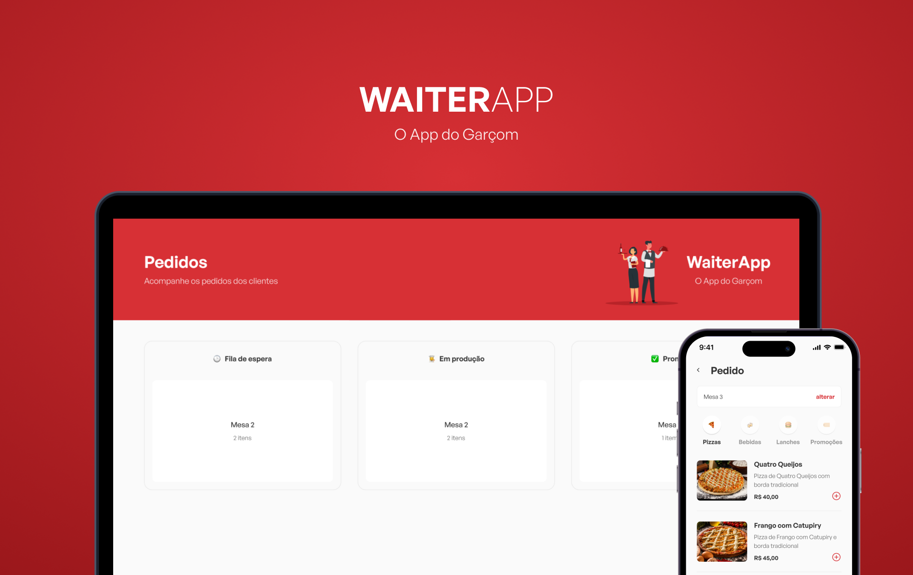

# WAITERAPP - O APP DO GARÇOM

> O WAITERAPP é uma aplicação para realização e gerenciamento de pedidos de um restaurante. O cliente ou garçom realiza o pedido do cliente e esse pedido é enviado para o dashboard dá cozinha.

## 👩‍💻 Tecnologias usadas
  
  ### Back-end

    * Node
    * Typescript
    * MongoDB
    * Websockets

  ### Front-end Web & Mobile

    * React / React Native
    * Typescript
    * Styled-Components
    
